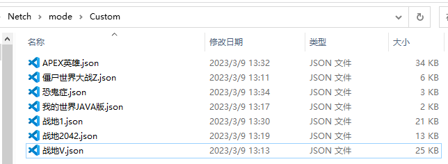
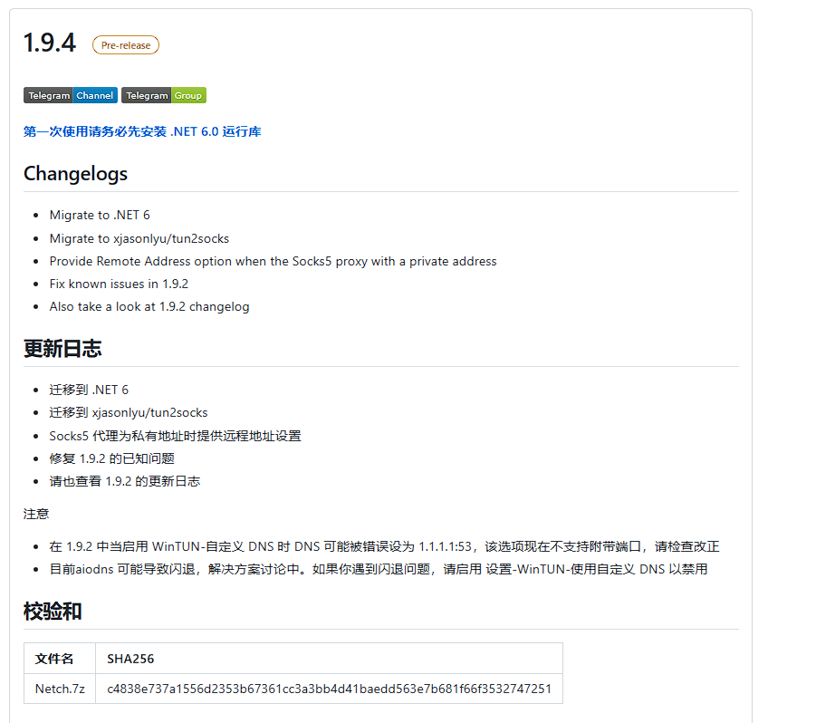
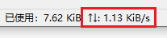
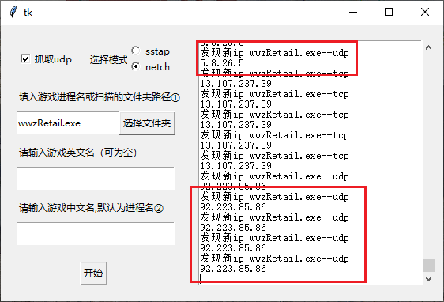
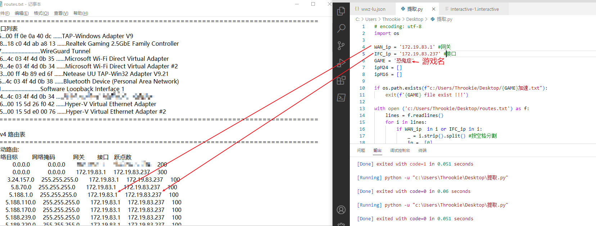

# 介绍

Netch 是最适合自建加速器的软件，如果你有不错的节点，就可以通过你的节点进行游戏加速而不是去购买加速器。

本项目提供了部分我玩的游戏的规则，还有一些软件使用踩过的坑。

如果netch进程代理模式会经常断连，那可以试下路由代理模式。还有代理太多ip好像会不稳定。。。

# 规则使用方法

将json文件复制到你的netch目录`Netch\mode\Custom` 中

# netch常见问题

## 加速没有速度

1. 确保节点是正常连接的

2. 安装.NET6.0运行库  [Releases · netchx/netch · GitHub](https://github.com/netchx/netch/releases) 官方有说明
   
   

只要加速没有速度就是没加速上，一般速度要经常为10kb以上，以下这种1kb的不算加速上

# 如何自己获取想玩的游戏规则

## 方法一 :

此方法比较费力，需要一个一个的找udp ip，但加速成功了挺稳定的。

下载以下软件

[GitHub - oooldtoy/SSTAP_ip_crawl_tool: 一个自动获取游戏远程ip，并自动写成SSTAP/NETCH规则文件的脚本](https://github.com/oooldtoy/SSTAP_ip_crawl_tool#sstap_ip_crawl_tool)

进行游戏，需要**玩几把**抓取服务器ip，这样抓到的ip才多。

选择udp的ip，我觉得这是游戏服务器的地址ip，加速它就可以加速游戏。加速其他TCP的ip如果节点不好可能会偶尔断连。

## 方法二：

此方法比较方便，但是会加速很多ip，节点较好应该问题不大。

- uu加速器（路由模式）

- 小黑盒加速器（模式一）

可以去b站随便找个免费cdk，大部分加速器都有路由模式。

1. `git clone https://github.com/Throokie/Netch-use.git `

2. `cd Netch-use`

3. 去加速游戏，然后打印路由表`route print -4 > routes.txt`，ip选加速后新增加的。修改`提取.py`

4. `python 提取.py`